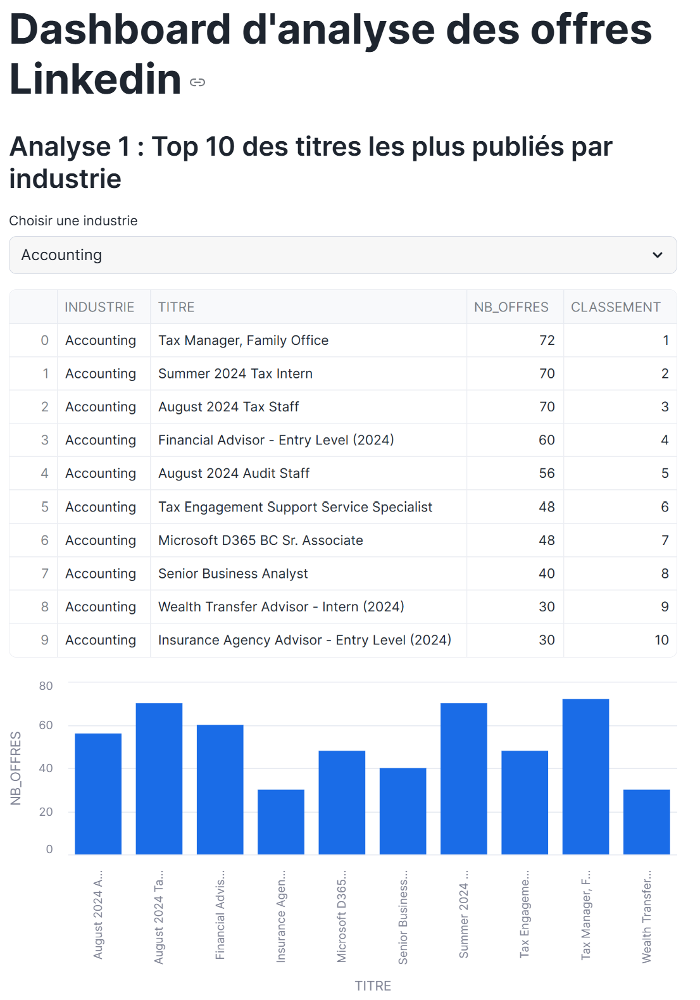
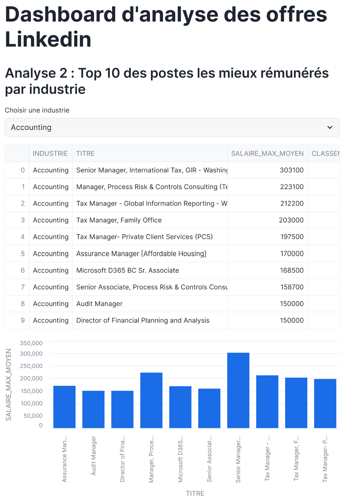
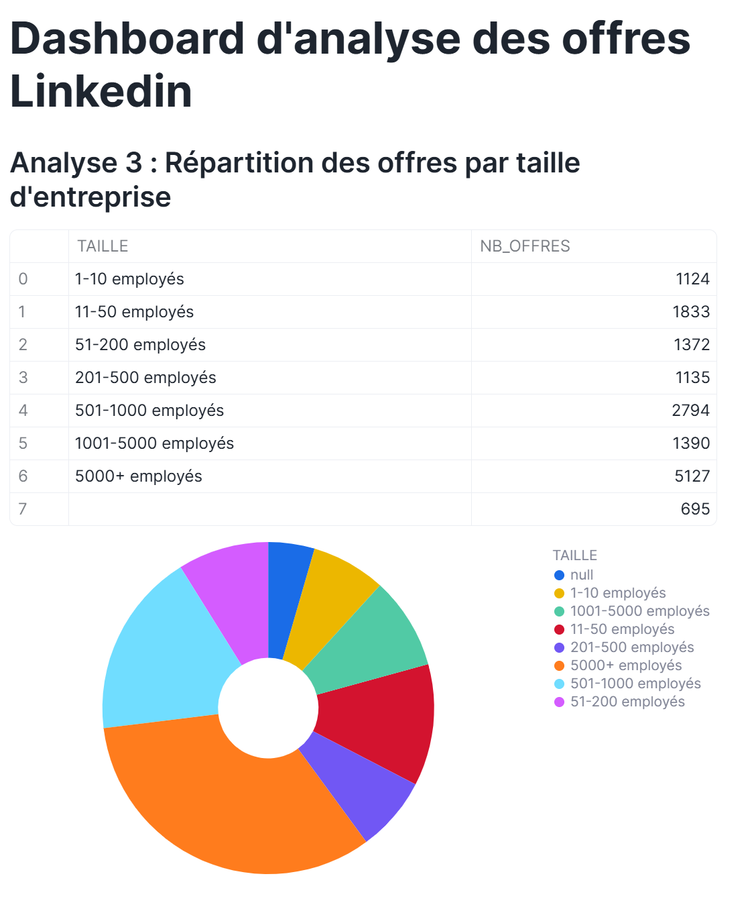
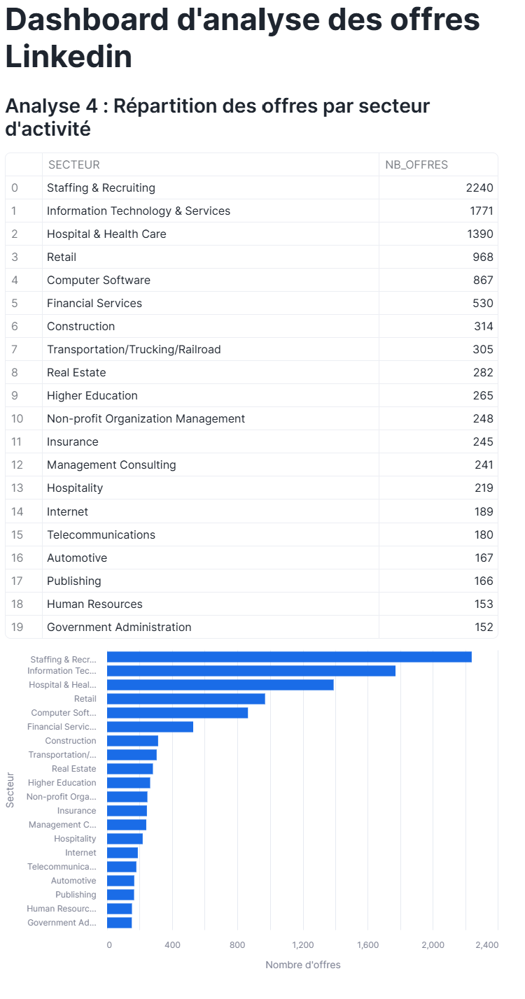
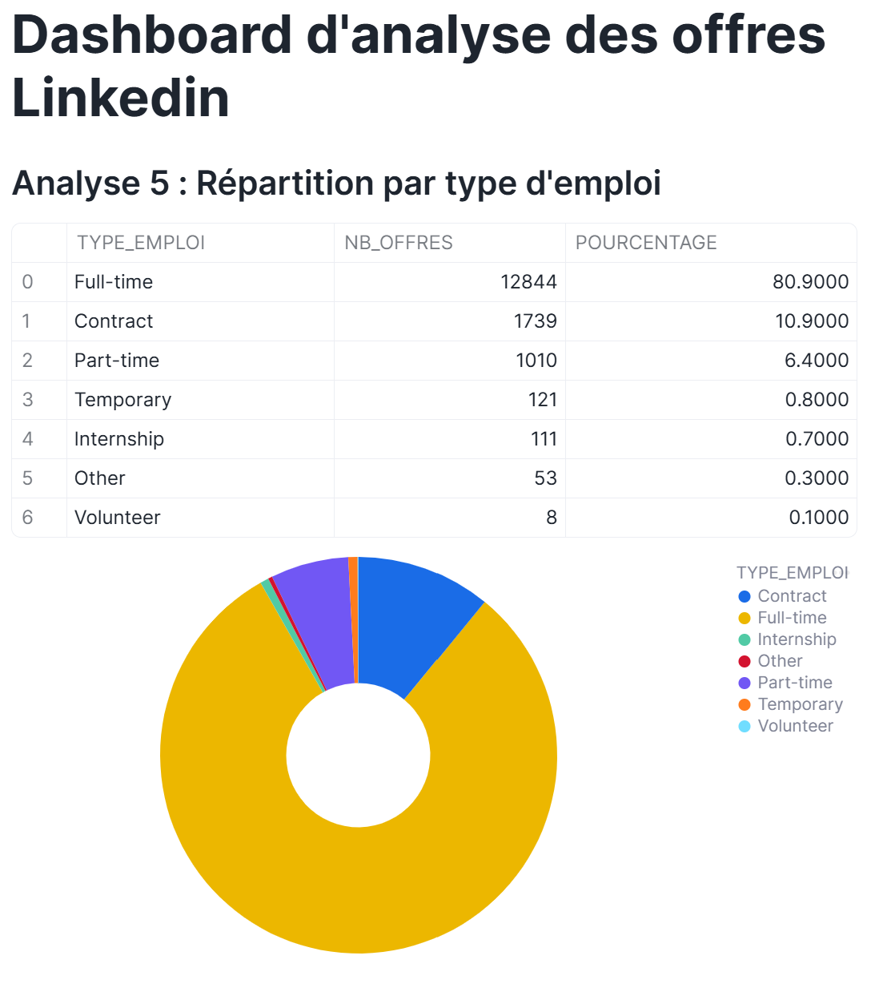

# 🧊 Analyse des Offres d'Emploi LinkedIn avec Snowflake

## 📌 Contexte

Dans le cadre de ce projet, nous exploitons un jeu de données LinkedIn contenant plusieurs milliers d'offres d'emploi. Les données sont stockées dans un bucket S3 public et chargées dans Snowflake pour réaliser des analyses sur le marché du travail.

---

## 🎯 Objectif

Analyser les offres d'emploi LinkedIn en utilisant Snowflake et Streamlit pour répondre aux 5 questions suivantes :
1. Quels sont les titres de postes les plus publiés par industrie ?
2. Quels sont les postes les mieux rémunérés par industrie ?
3. Comment se répartissent les offres par taille d'entreprise ?
4. Quels sont les secteurs d'activité qui recrutent le plus ?
5. Quelle est la répartition des offres par type d'emploi ?

---

## 📁 Jeu de Données

Source : `s3://snowflake-lab-bucket/`

| Fichier | Format | Description |
|---------|--------|-------------|
| `job_postings.csv` | CSV | Offres d'emploi détaillées |
| `benefits.csv` | CSV | Avantages associés aux offres |
| `employee_counts.csv` | CSV | Nombre d'employés par entreprise |
| `job_skills.csv` | CSV | Compétences requises par offre |
| `companies.json` | JSON | Informations sur les entreprises |
| `company_industries.json` | JSON | Secteurs d'activité par entreprise |
| `company_specialities.json` | JSON | Spécialités par entreprise |
| `job_industries.json` | JSON | Secteurs associés à chaque offre |

---

## 🔧 Étapes de Réalisation

### 1. Création de la base de données et du stage

Nous créons la base de données `LINKEDIN`, le schéma `RAW` pour stocker les données brutes, ainsi qu'un stage externe pointant vers le bucket S3 contenant les fichiers LinkedIn.

```sql
CREATE DATABASE IF NOT EXISTS LINKEDIN;
CREATE SCHEMA IF NOT EXISTS LINKEDIN.RAW;
USE SCHEMA LINKEDIN.RAW;

CREATE OR REPLACE STAGE LINKEDIN_STAGE
  URL = 's3://snowflake-lab-bucket/';
```

### 2. Formats de fichiers

Nous définissons deux formats de fichiers : un pour les CSV qui gère les guillemets et les valeurs nulles, et un pour les JSON qui permet de lire chaque objet du tableau individuellement.

```sql
CREATE OR REPLACE FILE FORMAT csv_format
  TYPE                        = 'CSV'
  FIELD_OPTIONALLY_ENCLOSED_BY = '"'
  SKIP_HEADER                 = 1
  NULL_IF                     = ('NULL', 'null', '')
  EMPTY_FIELD_AS_NULL         = TRUE;

CREATE OR REPLACE FILE FORMAT json_format
  TYPE              = 'JSON'
  STRIP_OUTER_ARRAY = TRUE;
```

### 3. Création des tables

Nous créons les 8 tables qui accueilleront les données. Toutes les colonnes sont en VARCHAR pour éviter les erreurs de typage lors du chargement.

```sql
CREATE OR REPLACE TABLE job_postings (
  job_id VARCHAR, company_name VARCHAR, title VARCHAR,
  description TEXT, max_salary VARCHAR, med_salary VARCHAR,
  min_salary VARCHAR, pay_period VARCHAR, formatted_work_type VARCHAR,
  location VARCHAR, applies VARCHAR, original_listed_time VARCHAR,
  remote_allowed VARCHAR, views VARCHAR, job_posting_url VARCHAR,
  application_url VARCHAR, application_type VARCHAR, expiry VARCHAR,
  closed_time VARCHAR, formatted_experience_level VARCHAR,
  skills_desc TEXT, listed_time VARCHAR, posting_domain VARCHAR,
  sponsored VARCHAR, work_type VARCHAR, currency VARCHAR,
  compensation_type VARCHAR
);
-- + 7 autres tables : benefits, companies, employee_counts,
-- job_skills, job_industries, company_industries, company_specialities
```

### 4. Chargement des données

Nous chargeons les données depuis le bucket S3 vers les tables Snowflake à l'aide de la commande `COPY INTO`. Les fichiers CSV sont importés directement, tandis que les fichiers JSON nécessitent d'extraire chaque champ manuellement avec la notation `$1:nom_du_champ`.

```sql
COPY INTO job_postings
FROM @linkedin_stage/job_postings.csv
FILE_FORMAT = csv_format
ON_ERROR = 'CONTINUE';
```

---

## ⚠️ Problème rencontré

Lors de l'exploration des données, nous avons constaté que la colonne `company_name` dans `job_postings` contient en réalité un identifiant numérique au format `24601924.0` et non un nom d'entreprise. Nous utilisons donc `SPLIT_PART` pour supprimer le `.0` et faire correspondre cet identifiant avec le `company_id` de la table `companies`.

```sql
JOIN companies c ON SPLIT_PART(jp.company_name, '.', 1) = c.company_id
```

---

## 📊 Analyses SQL

### Analyse 1 — Top 10 des titres les plus publiés par industrie

```sql
SELECT
  ci.industry AS industrie,
  jp.title AS titre,
  COUNT(*) AS nb_offres,
  ROW_NUMBER() OVER (PARTITION BY ci.industry ORDER BY COUNT(*) DESC) AS classement
FROM job_postings jp
JOIN companies c ON SPLIT_PART(jp.company_name, '.', 1) = c.company_id
JOIN company_industries ci ON c.company_id = ci.company_id
GROUP BY ci.industry, jp.title
QUALIFY classement <= 10
ORDER BY ci.industry, nb_offres DESC;
```
**Résultat :** Dans le secteur Accounting, le poste 'Tax Manager, Family Office' arrive en tête avec 72 offres publiées, suivi des postes de Tax Intern et Tax Staff avec 70 offres chacun. Cela reflète une forte demande dans les métiers de la fiscalité et de la comptabilité

### Analyse 2 — Top 10 des postes les mieux rémunérés par industrie

```sql
SELECT
  ci.industry AS industrie,
  jp.title AS titre,
  ROUND(AVG(TRY_CAST(jp.max_salary AS FLOAT)), 0) AS salaire_max_moyen,
  ROW_NUMBER() OVER (PARTITION BY ci.industry ORDER BY AVG(TRY_CAST(jp.max_salary AS FLOAT)) DESC) AS classement
FROM job_postings jp
JOIN companies c ON SPLIT_PART(jp.company_name, '.', 1) = c.company_id
JOIN company_industries ci ON c.company_id = ci.company_id
WHERE jp.max_salary IS NOT NULL AND jp.max_salary != ''
GROUP BY ci.industry, jp.title
QUALIFY classement <= 10
ORDER BY ci.industry, salaire_max_moyen DESC;
```
**Résultat :** Dans le secteur Accounting, le Senior Manager en fiscalité internationale arrive en tête avec un salaire maximum moyen de 303 100, suivi du Manager en Risk & Controls Consulting à 223 100. Cela confirme que les postes de management senior sont les mieux rémunérés.

### Analyse 3 — Répartition par taille d'entreprise

```sql
SELECT
  CASE c.company_size
    WHEN '0' THEN 'Solo'
    WHEN '1' THEN '1-10 employés'
    WHEN '2' THEN '11-50 employés'
    WHEN '3' THEN '51-200 employés'
    WHEN '4' THEN '201-500 employés'
    WHEN '5' THEN '501-1000 employés'
    WHEN '6' THEN '1001-5000 employés'
    WHEN '7' THEN '5000+ employés'
  END AS taille,
  COUNT(jp.job_id) AS nb_offres
FROM job_postings jp
JOIN companies c ON SPLIT_PART(jp.company_name, '.', 1) = c.company_id
GROUP BY c.company_size, taille
ORDER BY c.company_size;
```

**Résultat :** Les très grandes entreprises de 5000+ employés publient le plus d'offres avec 5 127 postes, suivies des entreprises de 501-1000 employés avec 2 794 offres. Les très petites structures de 1-10 employés restent les moins actives avec seulement 1 124 offres.

### Analyse 4 — Répartition par secteur d'activité

```sql
SELECT
  ci.industry AS secteur,
  COUNT(DISTINCT jp.job_id) AS nb_offres
FROM job_postings jp
JOIN companies c ON SPLIT_PART(jp.company_name, '.', 1) = c.company_id
JOIN company_industries ci ON c.company_id = ci.company_id
GROUP BY ci.industry
ORDER BY nb_offres DESC
LIMIT 20;
```

**Résultat :** Le secteur Staffing & Recruiting domine avec 2 240 offres, suivi de l'IT & Services et de la santé.

### Analyse 5 — Répartition par type d'emploi

```sql
SELECT
  formatted_work_type AS type_emploi,
  COUNT(*) AS nb_offres,
  ROUND(COUNT(*) * 100.0 / SUM(COUNT(*)) OVER (), 1) AS pourcentage
FROM job_postings
WHERE formatted_work_type IS NOT NULL AND formatted_work_type != ''
GROUP BY formatted_work_type
ORDER BY nb_offres DESC;
```

**Résultat :** Les offres Full-time représentent 80.9% des publications, confirmant que LinkedIn est principalement utilisé pour le recrutement de postes permanents.

---

## 📈 Visualisations Streamlit

Les visualisations sont réalisées avec Streamlit directement dans Snowflake. Chaque analyse dispose d'un onglet interactif avec un graphique en barres.


### Analyse 1 :
#### Code Streamlit

```python
if analyse == "Analyse 1 : Top titres par industrie":

    st.subheader("Analyse 1 : Top 10 des titres les plus publiés par industrie")

    query = """
    SELECT
        ci.industry AS industrie,
        jp.title AS titre,
        COUNT(*) AS nb_offres,
        ROW_NUMBER() OVER (
            PARTITION BY ci.industry
            ORDER BY COUNT(*) DESC
        ) AS classement
    FROM LINKEDIN.RAW.JOB_POSTINGS jp
    JOIN LINKEDIN.RAW.COMPANIES c
        ON SPLIT_PART(jp.company_name, '.', 1) = c.company_id
    JOIN LINKEDIN.RAW.COMPANY_INDUSTRIES ci
        ON c.company_id = ci.company_id
    GROUP BY ci.industry, jp.title
    QUALIFY classement <= 10
    ORDER BY ci.industry, nb_offres DESC
    """

    df = session.sql(query).to_pandas()

    industrie = st.selectbox(
        "Choisir une industrie",
        sorted(df["INDUSTRIE"].dropna().unique())
    )

    df_filtre = df[df["INDUSTRIE"] == industrie]

    st.dataframe(df_filtre, use_container_width=True)

    st.bar_chart(
        data=df_filtre,
        x="TITRE",
        y="NB_OFFRES"
    )
```


#### Choix de visualisation

Nous avons choisi un graphique en barres afin de comparer facilement le nombre d’offres publiées pour chaque titre de poste dans une industrie donnée. Le filtre interactif permet de sélectionner dynamiquement le secteur étudié.

#### Commentaire

Cette analyse met en évidence les métiers les plus recherchés selon les secteurs d’activité. Certains domaines comme la comptabilité présentent une forte demande pour les postes liés à la fiscalité et à l’audit.

#### Problème rencontré

L’affichage de toutes les industries simultanément rendait la visualisation difficile à lire. Nous avons donc ajouté un menu interactif permettant de filtrer les résultats par industrie.

### Analyse 2 :
#### Code Streamlit

```python
elif analyse == "Analyse 2 : Top salaires par industrie":

    st.subheader("Analyse 2 : Top 10 des postes les mieux rémunérés par industrie")

    query = """
    SELECT
        ci.industry AS industrie,
        jp.title AS titre,
        ROUND(AVG(TRY_CAST(jp.max_salary AS FLOAT)), 0) AS salaire_max_moyen,
        ROW_NUMBER() OVER (
            PARTITION BY ci.industry
            ORDER BY AVG(TRY_CAST(jp.max_salary AS FLOAT)) DESC
        ) AS classement
    FROM LINKEDIN.RAW.JOB_POSTINGS jp
    JOIN LINKEDIN.RAW.COMPANIES c
        ON SPLIT_PART(jp.company_name, '.', 1) = c.company_id
    JOIN LINKEDIN.RAW.COMPANY_INDUSTRIES ci
        ON c.company_id = ci.company_id
    WHERE jp.max_salary IS NOT NULL
    AND jp.max_salary != ''
    GROUP BY ci.industry, jp.title
    QUALIFY classement <= 10
    ORDER BY ci.industry, salaire_max_moyen DESC
    """

    df = session.sql(query).to_pandas()

    industrie = st.selectbox(
        "Choisir une industrie",
        sorted(df["INDUSTRIE"].dropna().unique())
    )

    df_filtre = df[df["INDUSTRIE"] == industrie]

    st.dataframe(df_filtre, use_container_width=True)

    st.bar_chart(
        data=df_filtre,
        x="TITRE",
        y="SALAIRE_MAX_MOYEN"
    )
```

#### Visualisation



#### Choix de visualisation

Un graphique en barres a été utilisé afin de comparer visuellement les salaires maximums moyens des différents postes selon chaque industrie.

#### Commentaire

Les résultats montrent que les postes spécialisés et les fonctions seniors disposent des rémunérations les plus élevées. Les écarts de salaires varient fortement selon les secteurs.

### Analyse 3 :
#### Code Streamlit

```python
elif analyse == "Analyse 3 : Répartition par taille d'entreprise":

    st.subheader("Analyse 3 : Répartition des offres par taille d'entreprise")

    query = """
    SELECT
        CASE c.company_size
            WHEN '0' THEN 'Solo'
            WHEN '1' THEN '1-10 employés'
            WHEN '2' THEN '11-50 employés'
            WHEN '3' THEN '51-200 employés'
            WHEN '4' THEN '201-500 employés'
            WHEN '5' THEN '501-1000 employés'
            WHEN '6' THEN '1001-5000 employés'
            WHEN '7' THEN '5000+ employés'
        END AS taille,
        COUNT(jp.job_id) AS nb_offres
    FROM LINKEDIN.RAW.JOB_POSTINGS jp
    JOIN LINKEDIN.RAW.COMPANIES c
        ON SPLIT_PART(jp.company_name, '.', 1) = c.company_id
    GROUP BY c.company_size, taille
    ORDER BY c.company_size
    """

    df = session.sql(query).to_pandas()

    st.table(df)

    chart = alt.Chart(df).mark_arc(innerRadius=50).encode(
        theta="NB_OFFRES:Q",
        color="TAILLE:N",
        tooltip=["TAILLE", "NB_OFFRES"]
    )

    st.altair_chart(chart, use_container_width=True)
```

#### Visualisation



#### Choix de visualisation

Nous avons choisi un graphique circulaire de type donut afin de représenter la répartition des offres selon la taille des entreprises de manière plus visuelle et intuitive.

#### Commentaire

Les entreprises de taille intermédiaire et les grandes entreprises publient la majorité des offres d’emploi. Les très petites structures restent minoritaires.


### Analyse 4 :
#### Code Streamlit

```python
elif analyse == "Analyse 4 : Répartition par secteur":

    st.subheader("Analyse 4 : Répartition des offres par secteur d'activité")

    query = """
    SELECT
        ci.industry AS secteur,
        COUNT(DISTINCT jp.job_id) AS nb_offres
    FROM LINKEDIN.RAW.JOB_POSTINGS jp
    JOIN LINKEDIN.RAW.COMPANIES c
        ON SPLIT_PART(jp.company_name, '.', 1) = c.company_id
    JOIN LINKEDIN.RAW.COMPANY_INDUSTRIES ci
        ON c.company_id = ci.company_id
    GROUP BY ci.industry
    ORDER BY nb_offres DESC
    LIMIT 20
    """

    df = session.sql(query).to_pandas()

    st.table(df)

    chart = alt.Chart(df).mark_bar().encode(
        x=alt.X("NB_OFFRES:Q", title="Nombre d'offres"),
        y=alt.Y("SECTEUR:N", sort="-x", title="Secteur"),
        tooltip=["SECTEUR", "NB_OFFRES"]
    )

    st.altair_chart(chart, use_container_width=True)
```

#### Visualisation



#### Choix de visualisation

Un graphique en barres horizontal a été choisi afin de faciliter la lecture des nombreux secteurs d’activité présents dans le jeu de données.

#### Commentaire

Cette analyse permet d’identifier les secteurs les plus actifs sur Linkedin. Le secteur Staffing & Recruiting apparaît comme l’un des plus représentés, suivi notamment par les secteurs technologiques et les services.

#### Problème rencontré

Le grand nombre de secteurs rendait les graphiques circulaires peu lisibles. Nous avons donc limité l’affichage aux 20 principaux secteurs afin d’améliorer la clarté de la visualisation.

### Analyse 5 :
#### Code Streamlit

```python
elif analyse == "Analyse 5 : Répartition par type d'emploi":

    st.subheader("Analyse 5 : Répartition par type d'emploi")

    query = """
    SELECT
        formatted_work_type AS type_emploi,
        COUNT(*) AS nb_offres,
        ROUND(COUNT(*) * 100.0 / SUM(COUNT(*)) OVER (), 1) AS pourcentage
    FROM LINKEDIN.RAW.JOB_POSTINGS
    WHERE formatted_work_type IS NOT NULL
    AND formatted_work_type != ''
    GROUP BY formatted_work_type
    ORDER BY nb_offres DESC
    """

    df = session.sql(query).to_pandas()

    st.table(df)

    chart = alt.Chart(df).mark_arc(innerRadius=60).encode(
        theta="NB_OFFRES:Q",
        color="TYPE_EMPLOI:N",
        tooltip=["TYPE_EMPLOI", "NB_OFFRES", "POURCENTAGE"]
    )

    st.altair_chart(chart, use_container_width=True)
```

#### Visualisation



#### Choix de visualisation

Un graphique donut a été utilisé afin de visualiser rapidement la proportion des différents types de contrats proposés sur Linkedin.

#### Commentaire

Les offres Full-time représentent la grande majorité des publications, ce qui confirme que Linkedin est principalement utilisé pour le recrutement de postes permanents.


---

## 📂 Structure du Repo

├── README.md        ← Ce fichier

└── TP.ipynb         ← Notebook Snowflake avec le code complet

└── streamlit         ← Dossier avec les codes streamlit

---

## 👥 Répartition des tâches

| Membre | Responsabilités |
|--------|----------------|
| Melissa TRESO | Setup Snowflake, chargement des données, analyses |
| Jade IOUALALEN| Visualisations Streamlit |

---

